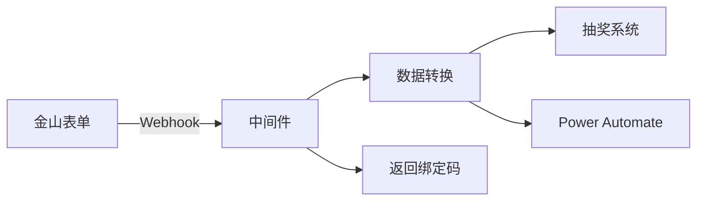

# 抽奖系统 Webhook 中间件

[](https://github.com/HNRobert/Lottery-Tool-Middleware/actions/workflows/ci-tests.yml)
[](https://github.com/HNRobert/Lottery-Tool-Middleware/actions/workflows/docker-build-and-push.yml)
[](https://github.com/HNRobert/Lottery-Tool-Middleware/pkgs/container/lottery-tool-middleware)

一个用于处理金山表单 webhook 并转发到抽奖系统和 Power Automate 的 Python 中间件服务。

## 🎯 核心功能

- 🎯 **接收处理**：接收金山表单的 webhook 请求
- � **数据转换**：智能转换金山表单数据为抽奖系统格式
- 📧 **双向转发**：同时转发到抽奖系统和 Power Automate 邮箱
- ⚡ **异步处理**：后台处理，快速响应，生成绑定码
- 🛡️ **健壮性**：完整的错误处理和日志记录
- 🐳 **容器化**：基于 Alpine Linux 的 Docker 部署
- 🧪 **可测试**：内置测试端点和测试脚本

## �📁 项目结构

```text
Lottery-Tool-Middleware/
├── src/                    # 源代码目录
│   ├── main.py            # 主应用文件 - FastAPI 应用
│   ├── models.py          # 数据模型 - Pydantic 模型
│   ├── transformer.py     # 数据转换器
│   ├── webhook_client.py  # HTTP 客户端
│   └── tests/             # 单元测试
├── docs/                  # 📚 文档目录
│   ├── API.md            # 接口文档
│   ├── QUICK_START.md    # 快速部署
│   ├── USAGE.md          # 使用指南
│   └── DEPLOYMENT.md     # 部署运维
├── scripts/               # 🔧 脚本目录
│   ├── start.sh          # 本地启动脚本
│   └── docker.sh         # Docker 部署脚本
├── docker-compose.yml     # 生产环境 Docker 配置
├── docker-compose.dev.yml # 开发环境 Docker 配置
├── Dockerfile            # Docker 镜像配置
├── requirements.txt      # Python 依赖
└── .env.example         # 环境变量模板
```

## 🚀 快速开始

📚 **文档导航：**

1. 📖 [快速部署指南](docs/QUICK_START.md) - 3 种部署方式对比和选择
2. 📋 [使用指南](docs/USAGE.md) - 配置、测试和故障排除
3. � [API 接口文档](docs/API.md) - 完整的接口规范和示例
4. 🚀 [部署和运维指南](docs/DEPLOYMENT.md) - 生产环境部署和监控

### ⚡ 最快启动（30 秒上手）

```bash
# 1. 克隆项目
git clone <repository-url>
cd Lottery-Tool-Middleware

# 2. 配置环境
cp .env.example .env
# 编辑 .env 文件中的 Power Automate URL

# 3. 一键启动（三选一）
./scripts/start.sh --install       # 本地开发
./scripts/docker.sh --dev         # Docker 开发
./scripts/docker.sh --prod        # Docker 生产

# 4. 验证服务
curl http://localhost:9732/health
```

## 🎯 核心工作流程



1. **接收**：金山表单发送 webhook 到中间件
2. **转换**：提取姓名、学号、邮箱、手机号等信息
3. **转发**：并发发送到抽奖系统和 Power Automate
4. **响应**：立即返回 20 位绑定码给用户

### 📊 数据转换示例

**输入**：金山表单 webhook 数据

```json
{
  "event": "create_answer",
  "answerContents": [
    { "qid": "k9ce0p", "title": "姓名｜Name", "value": "张三" },
    { "qid": "br1kvx", "title": "学号｜Student ID", "value": "2023001" },
    {
      "qid": "30f4xe",
      "title": "UNNC邮箱｜UNNC Email",
      "value": "test@unnc.edu.cn"
    },
    {
      "qid": "7wpvum",
      "title": "手机号｜Telephone Number",
      "value": "13800138000"
    }
  ]
}
```

**输出 1**：发送到抽奖系统

```json
{
  "code": "2023001",
  "participant_info": {
    "name": "张三",
    "phone": "13800138000",
    "email": "test@unnc.edu.cn"
  }
}
```

**输出 2**：返回给用户

```json
{
  "bind_code": "20250805666666666666"
}
```

> 📝 **bind_code 说明**: 绑定码从环境变量 `BIND_CODE` 读取，用于标识表单提交。这是一个固定值，。

## 🛠️ 核心组件

- **FastAPI** - 高性能异步 Web 框架
- **Pydantic** - 数据验证和序列化
- **Requests** - HTTP 客户端
- **Alpine Linux** - 轻量级容器基础镜像
- **Uvicorn** - ASGI 服务器

## 📝 技术规格

- **Python**: 3.11+
- **端口**: 9732（可配置）
- **内存**: ~50MB（容器运行时）
- **启动时间**: <3 秒
- **并发**: 支持异步处理
- **日志**: 结构化日志记录

## 🔗 相关链接

- [FastAPI 官方文档](https://fastapi.tiangolo.com/)
- [Docker 部署指南](docs/DEPLOYMENT.md)
- [API 接口规范](docs/API.md)

## 📄 许可证

[添加许可证信息]

## 🤝 贡献

欢迎提交 Issues 和 Pull Requests！

---

**项目维护者**: [添加维护者信息]  
**更新时间**: 2025 年 8 月

## 安全考虑

- 支持 Bearer Token 认证（抽奖系统）
- CORS 配置
- 请求日志记录
- 输入数据验证

## 部署建议

### 开发环境(dev)

```bash
python main.py
```

### 生产环境(prod)

```bash
uvicorn main:app --host 0.0.0.0 --port 8000 --workers 4
```

### Docker 部署

```dockerfile
FROM python:3.11-slim

WORKDIR /app
COPY requirements.txt .
RUN pip install -r requirements.txt

COPY . .
EXPOSE 8000

CMD ["uvicorn", "main:app", "--host", "0.0.0.0", "--port", "8000"]
```

## 监控

建议监控以下指标：

- HTTP 请求成功率
- 响应时间
- 转发成功率
- 错误日志频率

## 故障排除

### 常见问题

1. **端口已被占用**

   ```bash
   # 更改环境变量中的PORT
   PORT=8001 python main.py
   ```

2. **抽奖系统连接失败**

   - 检查`LOTTERY_WEBHOOK_URL`和`LOTTERY_WEBHOOK_TOKEN`
   - 确认网络连通性
   - 查看日志文件

3. **数据转换失败**
   - 检查金山表单字段映射
   - 确认必要字段存在

## 许可证

MIT License

## 贡献

欢迎提交 Issue 和 Pull Request。
